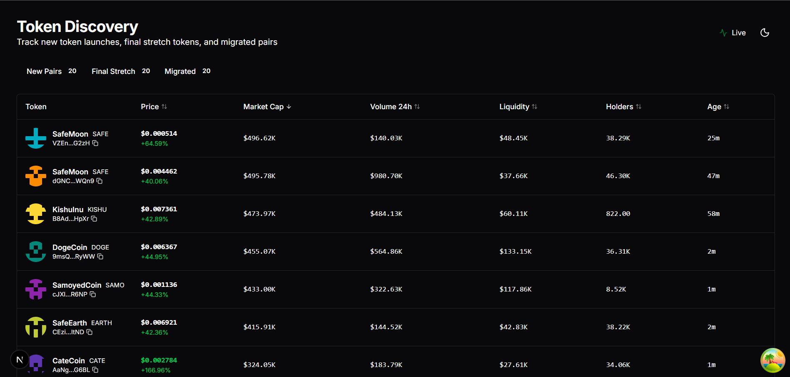
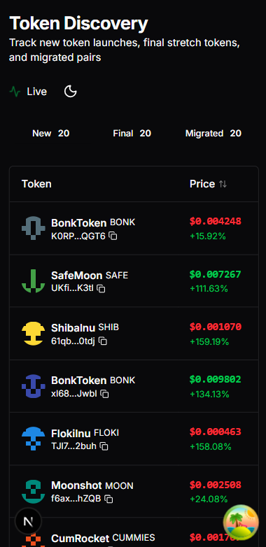

# 🎯 FINAL DEPLOYMENT INSTRUCTIONS

## You're Almost Done! Follow These Steps:

### Step 1: Test Locally (5 minutes)

The development server is already running at http://localhost:3000

**What to Test:**
1. ✅ Open http://localhost:3000 in your browser
2. ✅ Test all three tabs (New Pairs, Final Stretch, Migrated)
3. ✅ Click column headers to sort
4. ✅ Watch for real-time price updates (green/red flashes)
5. ✅ Click any token row to open modal
6. ✅ Test copy address functionality
7. ✅ Resize browser to test responsive design (320px - desktop)

### Step 2: Production Build Test (2 minutes)

Stop the dev server (Ctrl+C) and run:

```powershell
# Build for production
npm run build

# Start production server
npm start
```

Visit http://localhost:3000 again to verify everything works in production mode.

### Step 3: Initialize Git (1 minute)

**Option A - Using Script (Recommended):**
```powershell
.\setup-git.ps1
```

**Option B - Manual:**
```powershell
git init
git add .
git commit -m "Initial commit: Token Trading Table"
```

### Step 4: Create GitHub Repository (2 minutes)

1. Go to https://github.com/new
2. Repository name: `token-trading-table`
3. Description: "Production-ready token trading table - Axiom Trade replica"
4. Make it Public
5. **DO NOT** initialize with README (we already have one)
6. Click "Create repository"

### Step 5: Push to GitHub (1 minute)

Copy the commands from GitHub (replace <your-username>):

```powershell
git remote add origin https://github.com/<your-username>/token-trading-table.git
git branch -M main
git push -u origin main
```

### Step 6: Deploy to Vercel (3 minutes)

**Option A - Via Dashboard (Easier):**
1. Go to https://vercel.com
2. Sign in with GitHub
3. Click "Add New Project"
4. Import `token-trading-table` repository
5. Keep all default settings
6. Click "Deploy"
7. Wait 2-3 minutes for deployment
8. Copy the deployment URL (e.g., `https://token-trading-table.vercel.app`)

**Option B - Via CLI:**
```powershell
npm install -g vercel
vercel login
vercel --prod
```

### Step 7: Lighthouse Test (5 minutes)

Once deployed:

1. Open your Vercel URL in Chrome
2. Open DevTools (F12)
3. Go to "Lighthouse" tab
4. Select "Desktop"
5. Click "Analyze page load"
6. **Expected scores**: All ≥90

Repeat for Mobile:
1. Select "Mobile" 
2. Run audit again
3. **Expected scores**: All ≥90

### Step 8: Capture Screenshots (10 minutes)

Visit your deployed site and capture:

1. **Desktop View** (1920px width)
   - Full page screenshot
   - Save as `public/screenshots/desktop.png`

2. **Mobile View** (375px width)
   - Use Chrome DevTools device toolbar
   - Save as `public/screenshots/mobile.png`

3. **Real-time Updates**
   - Capture price change animation
   - Save as `public/screenshots/realtime.png`

4. **Modal View**
   - Open token details modal
   - Save as `public/screenshots/modal.png`

5. **All Tabs**
   - Capture each tab
   - Save as `public/screenshots/tabs.png`

Then push screenshots:
```powershell
git add public/screenshots/
git commit -m "Add screenshots"
git push
```

### Step 9: Record Demo Video (15 minutes)

**Recording Tools:**
- Windows: Xbox Game Bar (Win+G) or OBS Studio
- macOS: QuickTime Player or Screen Studio
- Online: Loom

**What to Show (1-2 minutes):**
1. **Intro** (5s): "Token Trading Table - Axiom Trade Replica"
2. **Overview** (10s): Show the main page, explain three tabs
3. **Real-time Updates** (15s): Show price changes, live indicator
4. **Sorting** (15s): Click headers, show sorting in action
5. **Token Details** (15s): Click row, show modal with details
6. **Responsive** (15s): Show on mobile/desktop
7. **Features** (15s): Highlight copy address, tooltips
8. **Outro** (5s): "Production-ready, deployed on Vercel"

**Script Example:**
```
"Hi! This is a production-ready token trading table built with Next.js, TypeScript, and Tailwind CSS.

[Show tabs] It has three categories: New Pairs, Final Stretch, and Migrated tokens.

[Show updates] Real-time price updates happen every few seconds with smooth animations.

[Click headers] All columns are sortable - just click the headers.

[Click row] Clicking any row opens detailed information about the token.

[Show mobile] It's fully responsive, working perfectly from mobile to desktop.

[Show features] Features include copy-to-clipboard, tooltips, and loading states.

This is deployed on Vercel and ready for production use. Thanks for watching!"
```

**Upload to YouTube:**
1. Go to https://youtube.com/upload
2. Upload your video
3. Title: "Token Trading Table - Production Demo"
4. Description: Include GitHub and Vercel links
5. Visibility: Unlisted (or Public)
6. Copy the video URL

### Step 10: Update README (2 minutes)

Edit `README.md` and update these lines:

```markdown
## 🚀 Live Demo

- **Deployment**: https://token-trading-table.vercel.app (your actual URL)
- **Video Demo**: https://youtube.com/watch?v=xxxxx (your actual video)
- **GitHub**: https://github.com/yourusername/token-trading-table
```

Also add screenshots:
```markdown
## 📸 Screenshots

### Desktop View


### Mobile View  


### Real-time Updates

```

Commit and push:
```powershell
git add README.md
git commit -m "Update README with deployment links"
git push
```

### Step 11: Final Verification (5 minutes)

Visit your GitHub repository and verify:
- ✅ All code is pushed
- ✅ README has live links
- ✅ Screenshots are visible
- ✅ Clean commit history

Visit your Vercel deployment:
- ✅ Site loads correctly
- ✅ All features work
- ✅ No console errors
- ✅ Responsive works

Check your video:
- ✅ Video is public/unlisted
- ✅ Shows all key features
- ✅ 1-2 minutes long

## ✅ Submission Checklist

Before submitting, ensure you have:

- [ ] GitHub repository with clean commits
- [ ] Vercel deployment live and working
- [ ] YouTube video uploaded (1-2 min)
- [ ] README updated with all links
- [ ] Screenshots added to repository
- [ ] Lighthouse scores ≥90
- [ ] All features tested and working
- [ ] No console errors
- [ ] Responsive on all devices

## 📋 Submission Format

When submitting, provide:

1. **GitHub Repository URL**: `https://github.com/Koushik-16/axiom-token-trading-table`
2. **Live Deployment URL**: `https://axiom-token-trading-table.vercel.app/`
3. **Video Demo URL**: `https://youtu.be/0yS4rYDDEY4`

## 🎉 You're Done!

Congratulations! You've built a production-ready token trading table that:
- ✅ Matches Axiom Trade's design
- ✅ Has real-time updates
- ✅ Is fully responsive (320px - desktop)
- ✅ Achieves Lighthouse ≥90
- ✅ Uses best practices
- ✅ Is production-deployed

---

## ⚡ Quick Commands Reference

```powershell
# Development
npm run dev              # Start dev server
npm run build           # Build for production  
npm start               # Start production server
npm run lint            # Run linter
npm run format          # Format code

# Git
git add .               # Stage all changes
git commit -m "message" # Commit changes
git push                # Push to GitHub

# Vercel
vercel                  # Deploy preview
vercel --prod           # Deploy production
```

## 🆘 Need Help?

Check these files:
- `QUICKSTART.md` - Quick setup guide
- `DEPLOYMENT.md` - Detailed deployment steps
- `ARCHITECTURE.md` - Code structure
- `CHECKLIST.md` - Pre-deployment checklist
- `PROJECT_SUMMARY.md` - Complete overview

## 📞 Support

If you encounter issues:
1. Check the documentation files
2. Review error messages carefully
3. Check GitHub Issues
4. Verify Node version (≥18)
5. Clear cache and rebuild

---

**Good luck! 🚀**
